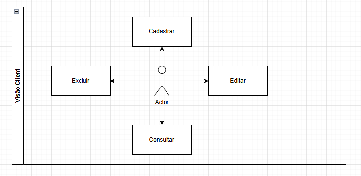
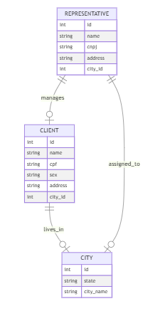
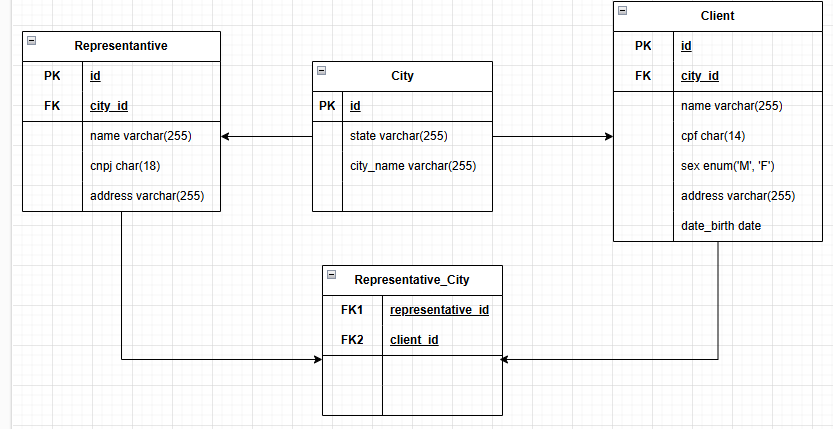

## DESAFIO :UPD8

API consta com dois CURDS simples de entidades: Ciente, Representantes e Cidade. No projeto de back-end, abordo uma arquitetura hexagonal, dividada em camadas como: Servives, Repositories, Http e Support.

No projeto abordo diversos temas com foco em Programação Orientada a Objetos (POO), Data Transfers Objects (DTOs).

Exploro o ecossistema do Framework Laravel, utilizando funcionalidades como Migrations, Eloquent, Relationships, Factories, Seeders, Providers e Cache. Abaixo segue mais detalhes.

### [Crie sua massa de testes para pessoa, CPF, CNPJ e afins, clicando aqui!](https://www.4devs.com.br/)

### Aplicação Web desenvolvida com:<br />
- Laravel 11x/PHP 8.0x<br />
- banco de dados MySQL<br/>

### Funcionalidades (Atualmente desenvolvidas)
<ul>
    <li>CRUD de Cliente</li>
    <li>CRUD de Representante</li>
    <li>Testes de Unidade e de Integração</li>
</ul>

### UML




### DIAGRAMA



### BANCO DE DADOS



## PASSOS:

<details>
<summary>Detalhes</summary>

### Requesitos necessários para executar o projeto:
<ul>
    <li>Instalar o PHP versão 8.0</li>
    <li>Instalar o Laravel versão 11.0</li>
    <li>Instalar o MySQL</li>
    <li>Instalar o composer</li>
    <li>Instalar o Postman ou Insomnia</li>
    <li>Instalar uma IDE de sua escolha (PHPStorm / VSCode)</li>
    <li>Instalar um cliente SQL de sua escolha (DBeaver / PHPMyAdmin / MySQL WorkBench)</li>
</ul>

### Executar o projeto:
<ul>
    <li>Clone o projeto: git clone https://github.com/HildebrandoLima/upd8_back_end.git</li>
    <li>Adicione o arquivo .env copiando o arquivo .env.example</li>
    <li>Certifique-se que um diretório chamado `**/vendor**` foi criado.</li>
    <li>Execute o comando: php artisan serve</li>
</ul>

### Banco de Dados:

> Obanco de dados é do tipo relacional.

### Criando o Banco de de Dados:

> No seu .env adicione da seguinte forma:<br />

> DB_CONNECTION=mysql<br />
> DB_HOST=localhost<br />
> DB_PORT=3306<br />
> DB_DATABASE=ms_delivery<br />
> DB_USERNAME=nome_do_usuario<br />
> DB_PASSWORD=sua_senha<br />

<br /><br />

> CACHE_STORE=database<br />
> CACHE_PREFIX=<br />
> CACHE_DRIVER=file<br />

Execute o comando para criar as tabelas:

```
    php artisan migrate
```

Execute o comando para preencher as tabelas:

```
    php artisan db:seed --class=DatabaseSeeder
```

Certifique-se que as tabelas foram criadas. Abra seu cliente SQL que você escolheu, e então execute o comando:

```
    SHOW TABLES;
```

### [Caso ocorra erro ao executar as migrations, clique aqui!](https://blog.renatolucena.net/post/como-fazer-rollback-de-migration-de-bd-no-laravel)

### Para iniciar o servidor:
`php artisan serve`
Agora acesse o endereço http://localhost:8000/api/rota em seu Postman ou Insomnia
</details>

### [API - Swagger](https://app.swaggerhub.com/apis-docs/HILDEBRANDOLIMA16/api-upd8/1.0.0)

## TESTES

Caso queira executar todos os testes, use o comando:

```
    php artisan test
```

Caso queira executar apenas os testes de integração, use o comando:

```
    php artisan test tests/Feature
```

Caso queira executar apenas os testes de unidade, para a camada de service, use o comando:

```
    php artisan test tests/Unit/Services
```

Caso queira executar apenas os testes de unidade, para a camada de repository, use o comando:

```
    php artisan test tests/Unit/Repositories
```

Caso queira executar apenas os testes de unidade, para ambas as camadas, use o comando:

```
    php artisan test tests/Unit
```

Caso queira executar apenas um teste em específico, use o comando:

```
    php artisan test --filter=ClassTest
```

Caso queira executar os grupos de testes específicos, use o comando:

```
    php artisan test ---group=NameGroup
```
